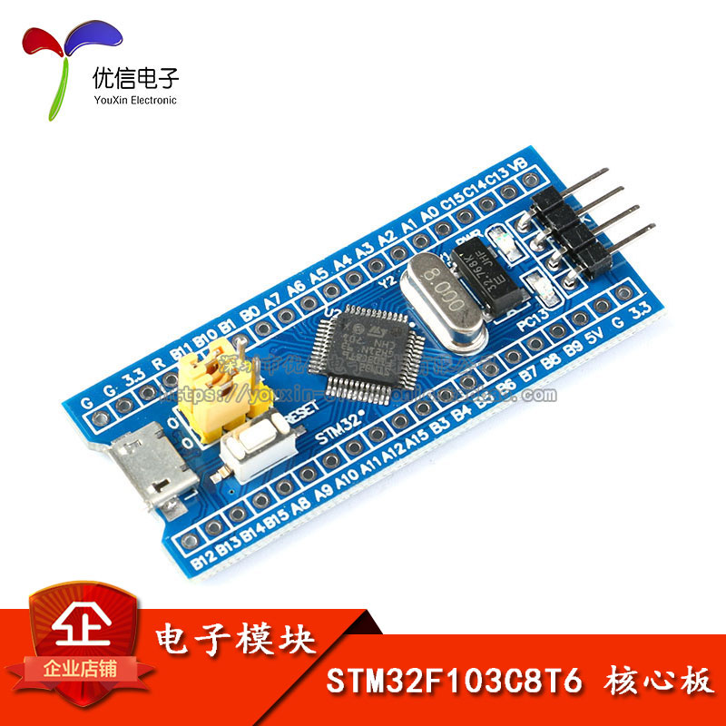
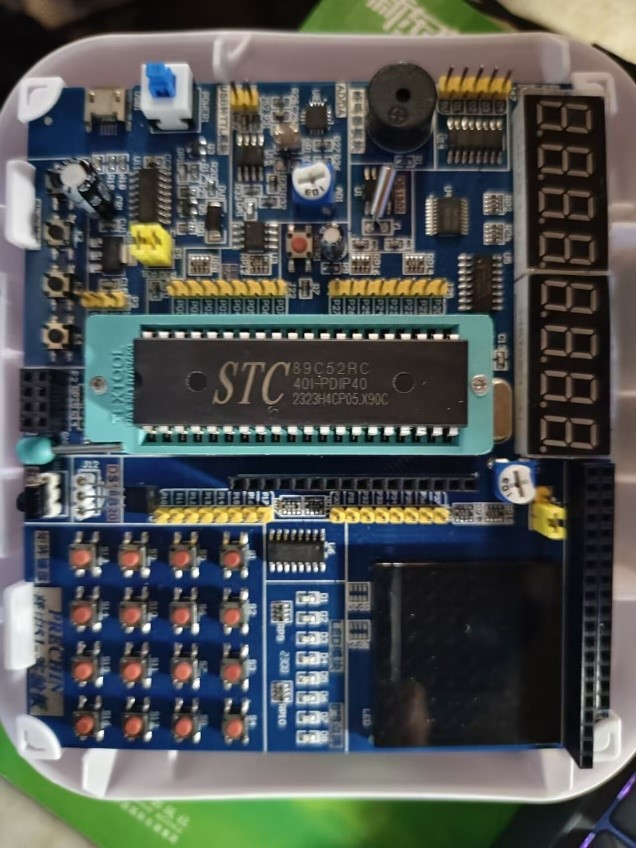
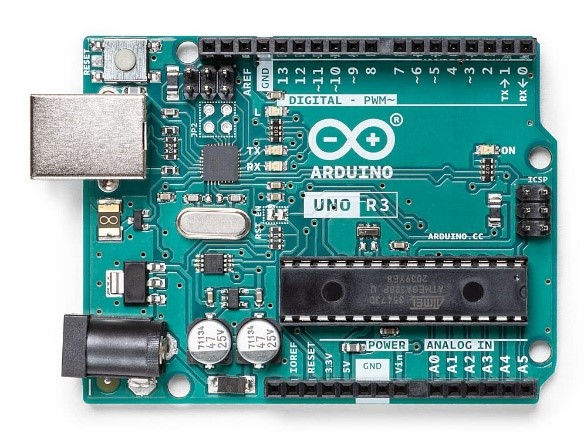
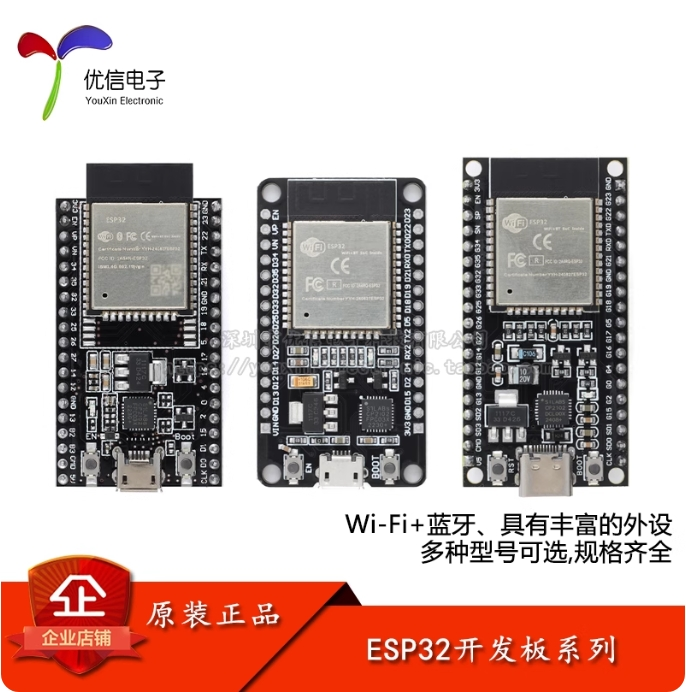
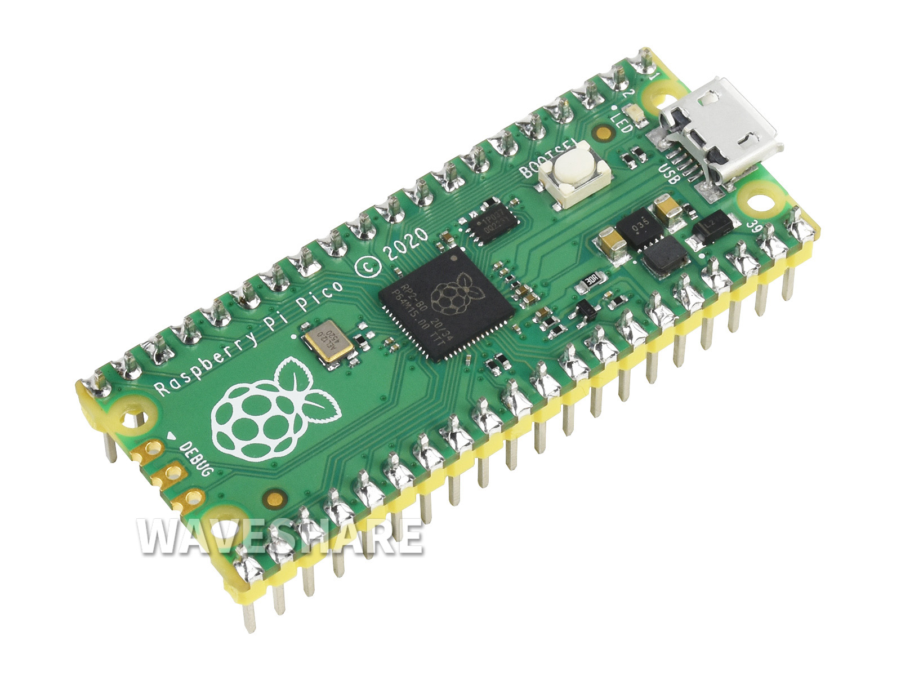

# 电子初学者指南——嵌入式软件篇

> 好的路线和教程固然事半功倍，但只有热爱与坚持才能让你在电子的路上一往无前。

**前言**：这篇文章是我根据自己以及身边朋友的学习经历整理的学习路线和内容，希望对大家有帮助。由于本人资历尚浅，加上完成较为仓促，有很多不完善的地方，也不够全面和准确，但这份指南将一直更新与完善。也算是抛砖引玉吧，希望大家能够指出错误与不足，提供自己的经验与建议，相信有了大家的帮助，它能够成为帮助初学者的指明灯。

---

## 〇、什么是嵌入式软件

> **嵌入式软件**是指**嵌入在硬件中的操作系统**和与之对应的**上位机开发工具及软件**，是嵌入式系统的重要组成部分。嵌入式系统通常由嵌入式微处理器（MCU）、外围硬件设备、嵌入式操作系统以及用户应用程序组成，用于实现对设备的控制、监视或管理功能。

说人话就是，我们需要使用对应的开发工具，通过对若干个芯片进行编程，控制若干个外设以及对获得的各种数据进行处理分析，实现我们需要达成的目标或完成对应的控制任务。嵌入式的本质就是控制，特定场景下的控制。

嵌入式软件有以下特性：

* 专用性：嵌入式软件是为**特定应用场景**设计的，通常面向特定行业或设备，具有高度的**定制化**。
* 紧密耦合：**与硬件深度结合**，需根据硬件特性进行优化。
* 高可靠性与实时性：特别是在安全关键领域（如工业控制、航空航天）中，嵌入式软件需要具备**高稳定性**和**实时响应**能力。

嵌入式软件广泛应用于工业控制、家用电器、汽车电子、通信设备等领域。同时，嵌入式软件的开发需要软硬件协同设计，强调代码的精简性和高效性，以满足嵌入式系统对功耗、成本和性能的严格要求。

那我们就可以理所当然的认为：学习嵌入式软件，你可以通过MCU、对应的外围电路以及相应的外设来达成你想要的各种各样的DIY电子产品：遥控小车，桌宠，音乐播放器，通过触摸屏做的一些小游戏以及与用户的交互，一款简易智能手表，部署AI语音助手，通过WIFI\BLE实现物联网相关内容，类似MI家的全屋智能，以及更高级的工业级的控制，甚至是机器人等等。在生活中常见的有：空调，可调亮度的台灯，打印机，显示器等等电子产品。

> 嵌入式软件，我们通常简称为嵌入式。下文我们便以**嵌入式**或者**软件**来代表**嵌入式软件**。
> 
> 而嵌入式硬件，我们通常简称为硬件。

## 一、语言

### 1. C/C++

**C语言**是最重要的基础，但是学习了基础的C语言是远远不够的，在学习的过程中可以穿插着一些最基础的编程题来加强语法的理解和记忆，大概学到链表之前。重点是：**循环语句，条件语句，指针，头文件，结构体**等等。再之后就可以边学单片机边学语言，同时也能根据具体的需求来学习语法加深印象。  
在嵌入式开发时，C语言的使用会有一定的侧重点，这方面知识往往需要重点学习，这种带有一定侧重点的C语言学习，我们一般称其为**嵌入式C语言**，需要重点了解的内容：

* 文件间的调用管理，如何自己创建源文件、头文件（.c.h）文件并进行联动，变量函数的引用声明，如#if的使用，#include的本质等。
* 静态变量，全局变量，局部变量等变量的管理的使用，不建议太多的全局变量占用临界区内存资源。
* 关于单片机运行程序的结构设计，函数的封装，状态机等等。
* 在定义函数和变量时的注释规范。

#### C/C++ 推荐课程

* [一小时速成C语言](https://www.bilibili.com/video/BV1Q142147VL/?share_source=copy_web&vd_source=fc720a503cd4ba33f929a63540a3d457)
  
  上面这个是速成课，并不能真的让你都学会，还是得搭配文档，多学多练才行。

* [翁恺的C语言教程](https://www.bilibili.com/video/BV1dr4y1n7vA/?share_source=copy_web&vd_source=fc720a503cd4ba33f929a63540a3d457)
* [黑马程序员的C++教程]( https://www.bilibili.com/video/BV1et411b73Z/?share_source=copy_web&vd_source=fc720a503cd4ba33f929a63540a3d457)

### 2. Python

**Python**一般在**嵌入式Linux**的开发中用的多，不过也有单片机能用MicroPython烧写固件。

### 3. 视觉部分

为了开发方便，一般的视觉运行库都会用Python，如**OpenCV**。或者使用**MicroPython**，如**Maixicam**、**K230**、**OpenMV**等等。其他的就是**神经网络**相关的新时代的算法，如**YOLO**模型的训练及使用等等。

## 二、单片机开发板学习

关于开发板该从何入手这个问题，见仁见智，我个人以及身边同学的学习路线也各有不同，毕竟除了收费的培训机构，其他的也没有专门一条龙的培训和教程。不过经过多方面考虑与斟酌，我们总结了一条较为可行，同时具有实用、效率、可发展性、深度的路线，虽然不可能适合所有人，不过如果觉得迷茫，可以先照着这条路学习，当你有了一定沉淀之后，就可以自己决定学习什么，也就形成了适合自己的路线。

### 0. 学习路线推荐 ！！！

在有C语言基础上，建议先从**STM32**入手，教程丰富，实用性强，目前的教程对初学者也比较友好，入门难度不会很大。STM32的入门推荐从**HAL库**开始，熟悉HAL库的开发后，就可以开始深入单片机的**底层结构**。

> 学校的专业课微机原理，它会以结构较为简单的51单片机为例讲解，以此学习底层结构更为通透。

学会读单片机的**数据手册**，一边积累**开发**和**Debug**经验，一边深入学习底层原理和进阶操作，之后有需求转向别的单片机也较为容易（当然STM32足够涵盖大部分单片机开发需求）。然后在开发过程中会接触到各种各样的**外设**，外设的**驱动控制**以及**通信**也是学习的一部分，在其中也会接触到相关的**算法**，如滤波算法，控制算法，博弈算法等等，为了实现整体项目的功能，也要自己设计整体的框架。从这里可以看出，大部分是软件的工作，当然项目的开发离不开硬件的基础，虽然目前大部分外设都已经模块化，但不可能所有项目只需要接线就能够完成，而关于硬件部分，将会在**硬件篇**说明。

关于**开发环境**， 不同的单片机开发可能会用不同的开发环境，同一系列的开发板也可以用不同的环境开发，通常在学习教程的时候，不同的教程会用到不同的环境，这就要求有一定融会贯通的能力，教程所用的环境也未必好用，在有一定基础时最好选择合适的开发环境配置，这对之后的学习开发能够起很大的便利作用。包括但不限于：

* 移植他人的代码。
* 团队间合作开发。
* 兼容多种设备场景等等。

> 关于开发工具链配置推荐，放在本篇的**第三部分**。

以下是适合初学者入门的开发板，在打一些**指定开发板型号**的比赛或者有特殊的需求时，大家还会接触到其他更多的开发板，就不在此列举了。而像算卡如树莓派，全志，RK等等系列的开发板将在**嵌入式Linux篇**展示。

### 1. STM32系列

<figure style="width: 400px">

#### 
 STM32F103C8T6最小系统板 

学嵌入式，得先有块单片机，一块**STM32F103C8T6**，足以承载学习的起点。其实如果只是为了方便跟着网上的课程，没有太大的必要购买对应的学习板或者套件，准备通用基础的设备也能够跟着学习，不过有条件的也建议支持，毕竟出一套免费教程不容易。

STM32主流有**HAL库，标准库，LL库，以及对寄存器操作**。我们建议学HAL库，HAL库的函数高度集成，免去了很多配置的麻烦，网上的教程资源也多。标准库已经停止更新维护，同时开发也较为繁琐。

那这三个库都有什么区别呢？

* HAL:开发简易，有图形化配置界面，但是它为了便捷性，一致性。在封装上就很难不会留下一些目前用不上的代码，在代码层面上就会有一些冗余，会白白浪费一小部分的芯片资源。
* 标准库：和HAL库相比是没有图形化配置界面，所有的初始化要自己手写完成，虽然大多数情况是复制粘贴过来的，性能相对较强，但是ST官方已经不推荐使用了，已经停止更新维护。
* LL库：它解决了HAL库、标准库的一系列问题，它的运行效率最高，能最大化的利用芯片，近乎于直接对寄存器进行操作，但是同样的开发较为繁琐，在芯片性能足够的情况是不需要考虑最大化利用芯片的。

#### HAL库视频教程

* [keysking的STM32教程](https://www.bilibili.com/video/BV12v4y1y7uV/?share_source=copy_web&vd_source=27c6949efd6f03d47f8efc82a2bab08c)
这个教程特点是快速好上手，动画效果优秀，用的是他们家波特律动的开发板。当然用普通的C8T6最小系统板学习也没问题，开发环境是**CubeIDE**，这个教程时长很短，适合用于先速通一遍，但是关于原理与开发细节不够深入。
* [铁头山羊的STM32教程](https://www.bilibili.com/video/BV16J4m1w7HB/?share_source=copy_web&vd_source=27c6949efd6f03d47f8efc82a2bab08c)
这个教程讲的比较细，用的是最小系统板开发，开发环境是**Keil+CubeMX**，可以和keysking的互补。

> 相对来说推荐大家一开始使用**Keil+CubeMX**，这个是大部分人的选择，Keil功能非常强大，除了界面相对古老。如果想要更好的开发体验推荐配**VSCode**、 **CLion**。
>
> 个人不推荐大家使用**CubeIDE**。

如果想要深入学习单片机的底层结构和原理，可以参考学习以下的教程和文档。

* [江协的STM32教程](https://www.bilibili.com/video/BV1th411z7sn/?share_source=copy_web&vd_source=27c6949efd6f03d47f8efc82a2bab08c)
一代的神，可惜讲的是**标准库**，也没有**CubeMX**初始化配置，不过十分建议在掌握了操作后仔细看关于原理的讲解部分，这是**精华**所在，讲的很干很细节，不过说是深入学习课，其实本质上也只是速通课，面向的还是新手，如果进一步学习就需要看**数据手册**。
* [硬汉嵌入式的STM32教程](https://www.bilibili.com/video/BV1LT4y117Ca/?share_source=copy_web&vd_source=27c6949efd6f03d47f8efc82a2bab08c)
这个教程是依据参考手册，数据手册，勘误手册和编程手册进行讲解，以**H7**系列的开发板为例，让大家知道知识的来源，同样是讲解的也是十分深入，甚至讲解了芯片的硬件设计逻辑，**MDK**这个开发工具的相关设计等等，我个人认为这个是新一代的神，但是不火。

#### 技术文档：

关于STM32的技术文档在网上并不难找，很多教程也会在资源里带有手册，视频教程只是帮助新手过渡学习的过程，真正到自己开发会遇到很多细节问题，会有很多奇奇怪怪的报错信息，教程很难会涉及到，所以一定要学会自己看手册，很多手册也有中文汉化，遇到不懂的专业词汇也可以结合AI解释，了解手册的结构，就能将它用作一本说明书，方便的获取自己想知道的信息，也可以了解之前没有学习过的芯片。

> AI是可以在一定层面上解决你遇到的问题的，但是AI不是万能的，当AI的输出几次不能满足需求的时候，就不要相信AI了，自行搜索往往能更快的达成目的，AI有的时候会睁眼说瞎话，并不能当作权威的信息来源。

#### 小结：

关于单片机的学习，其实不同的单片机都大同小异，学习了一种，其他的也能更快的掌握，学习了F103的板子，之后要学习F4、H7的板子就能够直接看文章，看文档学习配置与使用，同时也能在用新的板子时认识到有哪些东西是无脑照搬，有哪些是真正掌握能够自由改动的。

### 2. 51系列

<figure style="width: 400px; margin: 1em;">

#### 普中51学习板 

前面也说过，微机原理是以**51单片机**为例讲解的，虽然从使用角度来说，51单片机性能差，资源少，平时制作项目也基本不用（在部分公司的低端产品仍是用来压低成本的选择），但是从认识单片机底层硬件结构的角度来说，还是值得学习的，当然也没必要准备这么一套学习板来照着学习，要有使用需求也可以用最小的系统板。

#### 视频教程：

* [江协的51教程](https://www.bilibili.com/video/BV1Mb411e7re/?share_source=copy_web&vd_source=27c6949efd6f03d47f8efc82a2bab08c)

顺带一提，智能车会有赛道限制用**STC**的芯片，包括**STC8051**、**STC32**等等，赞助的企业也推出了一系列开发板，会有相关的教程，有兴趣的可以参考，不过目前也基本不用8位的了，能用32位的都用32位。

### 3. Arduino系列

<figure style="width: 400px; margin: 1em;">

####  arduino开发板 

非常简单方便，非常容易上手，代价是性能和上限，业余爱好者的福音，也有相当大的开源体量，有兴趣的同学可以自己找一找资料。

### 4. ESP系列

<figure style="width: 400px; margin: 1em;">

####  ESP32开发板 

同样是有着相当大开源规模的开发板，与**STM32**平分秋色。**ESP**系列主打物联网开发的极致性价比，处理性能也不弱，能够满足无线通信的开发以及各种外设的控制，不过引脚相对较少。

**ESP32**支持**Arduino**、**PlatformIO**、**ESP-IDF**三种开发框架，可根据不同的需求选择。

#### 视频教程

* [宸芯IOT的ESP32教程](https://www.bilibili.com/video/BV1eRg7exEcT/?share_source=copy_web&vd_source=27c6949efd6f03d47f8efc82a2bab08c)
这个教程是基于**ESP-IDF**来写的，**ESP-IDF**的特点是：

  - 驱动层基于**FreeRTOS 实时操作系统**来写，会有更高的效率，更多操作空间。
  - ESP32都是**双核驱动**，使用操作系统的调度方式更适合使用。
  - 适合大型项目开发，同时也是**ESP官方的SDK**。

> 这个up主最近几天也出了新的ESP32提高篇，同样推荐学习。

### 5. 树莓派pico

<figure style="width: 400px; margin: 1em;">

#### 树莓派pico 

可以用micro python开发的单片机，也有带有wifi模块的版本（pico w）性能价格对标esp32，Python开发可以调用很多库，开发环境也很简单。

#### 视频教程

* [Raspberry Pi Pico 快速上手](https://www.bilibili.com/video/BV1Fy4y1Y7um/?share_source=copy_web&vd_source=27c6949efd6f03d47f8efc82a2bab08c)

## 三、开发工具链配置

针对STM32的开发有不同的工具链选择，结合目前主流的教程，推荐先根据教程配置**Keil5+CubeMX**的工具链，跟着教程学习，熟悉开发内容和编译器调试的使用。更进一步可以考虑**Keil5+CubeMX+VSCode+EIDE**，能够在**VSCode**这个具有丰富生态，同时更加现代化模块集成的环境下开发，有更舒适、功能性更强的代码编写环境，在VSCode里就能实现基本上所有Keil5的功能包括文件管理，选项设置，编译烧录，Debug功能，并且可以和其他的使用Keil的朋友无缝使用等等。

* [VSCode+EIDE开发STM32](https://www.bilibili.com/video/BV1nr4y1R7Jb/?share_source=copy_web&vd_source=27c6949efd6f03d47f8efc82a2bab08c)

还可以考虑**CLion+CMake**的环境，当然EIDE也支持CMake，但是CMake的话，如果队友不会的话，那其中的学习成本，沟通成本。反而不如使用Keil划算。

* [keysking手把手教你用CLion开发STM32](https://www.bilibili.com/video/BV1pnjizYEAk/?share_source=copy_web&vd_source=27c6949efd6f03d47f8efc82a2bab08c)

## 四、软件工具推荐

免费软件的获取推荐微信公众号**伙伴神**，各种软件一应俱全。  

### 1. Git ！！！

这是一个开源的代码托管工具，你的项目代码可以通过Git上传到GitHub上，通过Git上的拉取、推送、合并，发布分支等等操作，可以实现多人协同开发，管理代码版本，回溯代码等等功能。在现代化集成开发环境上大多都有Git相关的插件/功能。

### 2. Proteus

硬件仿真软件，数电课会学，主要用在数字电路的仿真，可以和Keil对单片机联合仿真。

* [零基础的Keil与Proteus的联合仿真](https://www.bilibili.com/video/BV1g5411Q7EX/?share_source=copy_web)
  51单片机的仿真，可导入编译生成的文件运行。

### 3. Vofa+串口助手/serial plot

可以将串口接收到的信号转为波形图显示，陀螺仪的三维图显示等等，用来PID调参很方便。

### 4.Pulseview

使用**nano逻辑分析仪**时所用的上位机。

### 5. Watt Toolkit

免费，不违法的可用于**GitHub**的加速器。

## 五、硬件工具推荐

只讲关于单片机开发会用到的，关于焊接相关的放硬件篇。

### 1. 烧录工具

烧录工具是必备的，**STlink**基本只能给**STM32**的单片机用，更通用的有**DAPlink**，**Jlink**，大部分单片机支持串口烧录，但烧录较慢。建议至少准备STlink和DAPlink，建议准备一对无线烧录器（DAPlink）可以针对移动作品的开发，同时作为串口的无线通信。

### 2. 通信工具 / 调试工具

逻辑分析仪，**nanoDLA**优信电子30块一个，用来看设备间通信的数据是否正常，能够对通用的通信协议进行解析，也可以看PWM波正不正常。  
**串口转USB**，**CAN转USB**，**RS485转USB**等通信工具。

### 3. USB隔离口

用来接在电脑上与外接设备隔离，防止把电脑的**USB**口烧坏，感兴趣可以试试。

> 缺点：贵。如果使用便宜的隔离，它的数据传输速度很慢。

### 4. 拓展坞

如果电脑上的口不够用，可以接一个拓展坞，不过拓展坞上接烧录器烧录好像有概率识别不到，建议烧录器单独使用电脑上的接口。

## 六、单片机模块外设

关于外设这一块列举不尽，不同的项目方案也会用到各种各样的模块，这里主要介绍一些常用的模块。

### 电源模块

不可能所有的项目都用电脑的**USB**口供电，有需要独立移动的项目比如小车，就需要电池进行供电，关于电源供电这一块，偏向于硬件，里面有不少学问，会在硬件篇讲述，于是我们尽量采用现成的模块。

* 首先是**电池**，考虑到容量和电机驱动的要求，一般做小车**12V的锂电池**就够用了，建议买带包装的12V锂电池，三节**18650**电池或者三块聚合物电芯的都行，不建议用3节18650装电池盒里，主要是不方便，然后对功率或者放电倍率有要求的项目就需要**用航模电池**，这种电池容易鼓包容易炸，平时需要用平衡充充电，也要时常观察电压防止过放，可以用BB响插在电池上的接口，如果没电了会响。
* 然后是**稳压模块**，比如用了12V的电池，那肯定不能直接给单片机和5V/3.3V的模块供电，需要进行**降压**，可以使用12V转5V的**DCDC**开关电源模块，也有宽压输入，转5V、3.3V、以及一个可调稳压的多电源稳压模块。
* 关于供电，也要考虑好接口和稳压板的兼容。
* 单片机防烧说明 [开发板连接电机，烧坏芯片的原因、解决](https://blog.csdn.net/qq_49053936/article/details/138910278?fromshare=blogdetail&sharetype=blogdetail&sharerId=138910278&sharerefer=PC&sharesource=2303_79666194&sharefrom=from_link)
* 在没有做保护的的情况下，烧坏还有**电源反接**，**热插拔**（正确操作应该先接地，再接正极以及先拔正极再拔地线，或者同时接也可以）。关于预防单片机烧坏，最好需要自行设计整个项目的供电与保护电路，这一块在**硬件篇**说明。

### 传感器/按键

* 大部分模块化的**传感器**都能以高低电平的信号获取，还有的是**模拟量**，通过**ADC**获取。在买模块的时候，能问客服或者在网上能找到对应的说明。常用的有光电传感器，超声波，灰度，按键键盘等等。
* 还有是内置芯片需要进行**通信**获取数据的，如陀螺仪，磁力计，磁编码器等等，需要掌握**IIC**，**SPI**等通信协议的，也有高度集成过只需要**串口**通信解数据包的。

### 电机

* 一般最开始大家接触的多是便宜常见的小黄马达（**TT马达**），但是这种电机一来功率扭矩不够，二来死区也大，无法进行低转速的控制，只能做要求不高的玩具，虽然有的小黄（蓝）电机带**霍尔编码器**，但是电机素质不行，不如上好点的带编码器的**直流减速电机**。
* 然后关于角度控制，**舵机**用的很多，**sg90**这种塑料小舵机当然也不适合用在一些要求高的项目上，**mg996**就比较便宜，金属齿也不容易坏，再好一点的也有，但大差不差，普通的舵机本身也不适合做精密的控制，分辨率不高，有齿轮间隙。

> 舵机一定要注意，不要让它**堵转**，非常容易烧坏舵机，或者舵机有一部分不能使用。

* 成本较低的**精密控制**可以考虑**步进电机**，可以做步进电机滑台实现直线运动的控制，但是步进电机会**丟步**，最好搭配角度传感器如磁编码器做**闭环控制**，比如**张大头**的步进电机驱动做的很好，上位机功能丰富，自带**OLED**的配置菜单功能齐全，支持**串口**、**CAN**和**RS485**通信。
* 如果对速度有要求就需要用无刷电机，对扭矩有要求需要上减速器，比如无人机会用到的无刷电机，机械臂用到的伺服电机，一般不带驱动的无刷电机需要用电调驱动，提供pwm给电调驱动电机，也有带闭环驱动的无刷电机，只需要电源和信号线，不过就较为昂贵，达妙电机是性价比高的选择。

> 关于电调和电驱的区别：
> 
> 1.电调只能给他电流，可以控制快慢，不能精准控制电机的运动。（**开环**）
> 
> 2.而电驱是带反馈的，是读取到了编码器/电机上的电流等等数据，实现电机的精确控制。（**闭环**）

### 屏幕

* 一般用的多的是**OLED**小屏幕，毕竟基本教程都带，用起来方便小巧，如果有彩色以及大小需求，可以考虑**LCD-TFT**屏，用**SPI**驱动，能实现更多的显示需求。同时也可以选择带有触摸的屏幕。
* 如果想实现复杂的**UI**交互功能，又不想麻烦，可以考虑用淘晶驰的**串口屏**，里面内置MCU，用他们的上位机设计程序烧录进屏幕，就能达到效果，也可以将单片机与屏幕进行通信，实现更多功能。同时也可以选择 **RGB**协议的屏幕，单片机也有对应的协议支持驱动这种屏幕，相对于串口屏，diy程度更高，更适合开发。

## 七、单片机进阶学习

如果想用单片机实现多线程实时性强的项目时，为了便于管理多个任务，就不建议用裸机开发用中断实现，而是使用**RTOS**，其中最主流的就是**FreeRTOS**。

* [STM32Cubemx配置FreeRTOS快速入门](https://www.bilibili.com/video/BV1PMznYiEpu/?share_source=copy_web&vd_source=27c6949efd6f03d47f8efc82a2bab08c)

如果想用单片机驱动屏幕实现**GUI**设计，那可以考虑使用**LVGL**。

> LVGL是有专门的集成开发环境(IDE)的设计GUI的库，可以很方便的实现很多屏幕上的界面显示，与用户的交互，更流畅更方便的动画效果等等。
> 
> 如果追求更好的图形显示效果，推荐在嵌入式Linux上，通过QT来实现更加强大的功能，例如微信的图形界面就是使用QT来写的。

## 八、实践开发项目

除了往届的电赛题，网上还有很多适合初学者开发的开源项目，比如平衡车，倒立摆，智能手表，手写屏幕UI等等，如果缺乏灵感，也可以去立创开源平台看看 [立创开源平台](https://oshwhub.com/)

---

### 感谢大家能读到最后，希望这篇文档可以帮助大家更好的学习嵌入式，少走弯路。

##### 笔者：罗沈杨 姜云瀚 ...
##### 2025.9